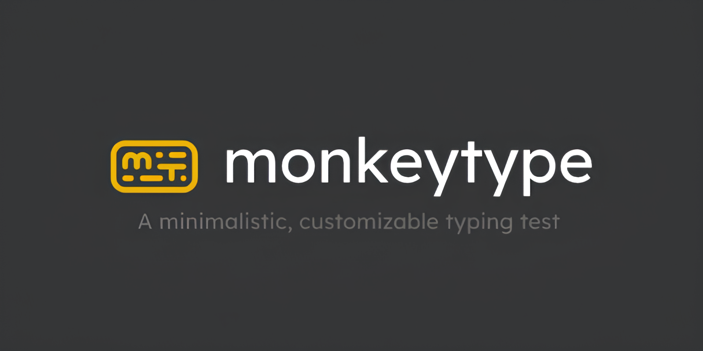
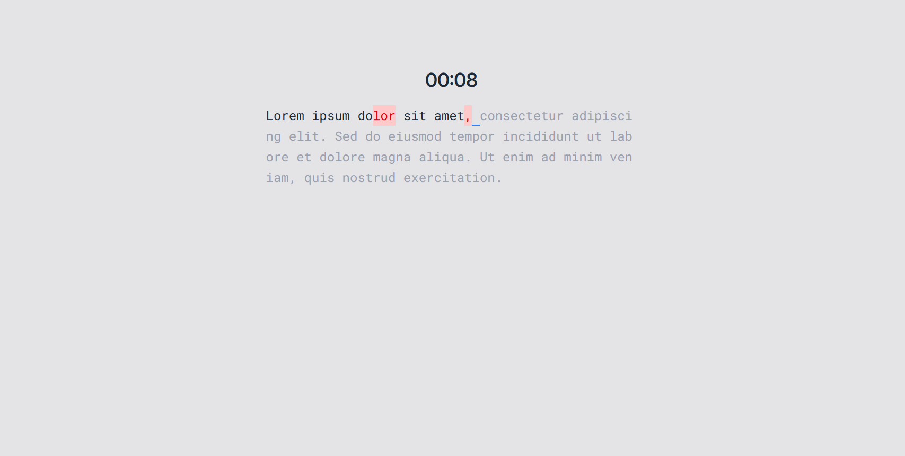
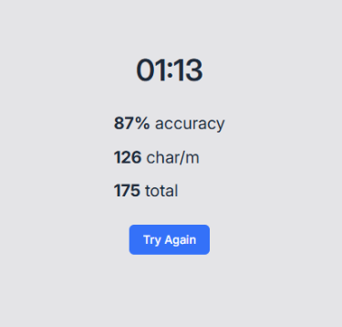

<div class="absolute top-10">
  <span class="font-700">
    Іван Попов
  </span>
</div>

<div class="absolute bottom-10">
  <h1>WORDWRITER</h1>
  <p>Тест на швидкість вашого друку</p>
</div>

---
layout: section
---

# НАТХНЕННЯ

<PageNumber />

---

# НАТХНЕННЯ



<PageNumber />

---

<h1>НАТХНЕННЯ</h1>

<span class="text-5xl">
  <span class="text-amber-400 font-500">Monkeytype</span> це <span class="text-blue-500">вебсайт</span> для <span class="text-green-400">тренування</span> швидкості та точності друку. Він дозволяє проходити тести з <span class="text-violet-400">різними</span> мовами та рівнями складності, відстежувати <span class="text-rose-500">статистику і прогрес</span>, а також <span class="text-cyan-400">адаптувати</span> робоче середовище під власні потреби.
</span>

<PageNumber />

---
layout: 3-images
imageLeft: ./assets/monkeytype-logo2.png
imageTopRight: ./assets/monkeytype-preview1.jpg
imageBottomRight: ./assets/monkeytype-preview2.png
---

---
layout: statement
---

# Перейдемо до проєкту

---
layout: section
---

# ЗОВНІШНІЙ ВИГЛЯД

<PageNumber />

---
layout: quote
---

# "Досконалість досягається не тоді, коли вже нічого додати, а тоді, коли вже нічого забрати"

\- Антуан де Сент-Екзюпері

<PageNumber />

---
layout: statement
---

## Саме тому дизайн зроблено простим і мінімалістичним, без зайвих елементів, щоб ніщо не відволікало від основної задачі.

<PageNumber />

---


<PageNumber />

---



<PageNumber />

---


<PageNumber />


---
layout: section
---

# ФУНКЦІОНАЛ

---

# ФУНКЦІОНАЛ

## Доступні тексти

```ts {all|2|4-6|8-13|all} 
const TEXTS = {
  small: 'Lorem ipsum dolor sit amet. Consectetur adipiscing elit.', // 56 characters

  medium: `Lorem ipsum dolor sit amet, consectetur adipiscing elit.
  Sed do eiusmod tempor incididunt ut labore et dolore magna aliqua.
  Ut enim ad minim veniam, quis nostrud exercitation.`,              // 180 characters
  
  large: `Lorem ipsum dolor sit amet, consectetur adipiscing elit,
  sed do eiusmod tempor. Incididunt ut labore et dolore magna aliqua.
  Ut enim ad minim veniam. Quis nostrud exercitation ullamco
  laboris nisi ut aliquip ex ea commodo. Duis aute irure dolor in reprehenderit
  in voluptate velit esse cillum. Excepteur sint occaecat cupidatat
  non proident, sunt in culpa qui officia.`,                         // 381 characters
}
```

---

# ФУНКЦІОНАЛ

## Підсвічування неправильних букв


<arrow v-click="[1, 2, 3]" x1="400" y1="150" x2="200" y2="250" color="#5500dd" width="3" arrowSize="1" />
<arrow v-click="[2, 3]" x1="400" y1="150" x2="300" y2="250" color="#5500dd" width="3" arrowSize="1" />
<arrow v-click="[3]" x1="400" y1="150" x2="425" y2="250" color="#5500dd" width="3" arrowSize="1" />

---

# ФУНКЦІОНАЛ

## Статистика



---
layout: section
---

# САЙТ

---
layout: statement
---

https://iiivanpopov.github.io/wordwriter/

---
layout: intro-image
class: text-center
image: https://unsplash.com/photos/_nWaeTF6qo0/download?ixid=M3wxMjA3fDB8MXxhbGx8fHx8fHx8fHwxNzY1NTU1NTE4fA&force=true
---

# Дякую за увагу!

---
layout: image
image: https://unsplash.com/photos/_nWaeTF6qo0/download?ixid=M3wxMjA3fDB8MXxhbGx8fHx8fHx8fHwxNzY1NTU1NTE4fA&force=true
---
